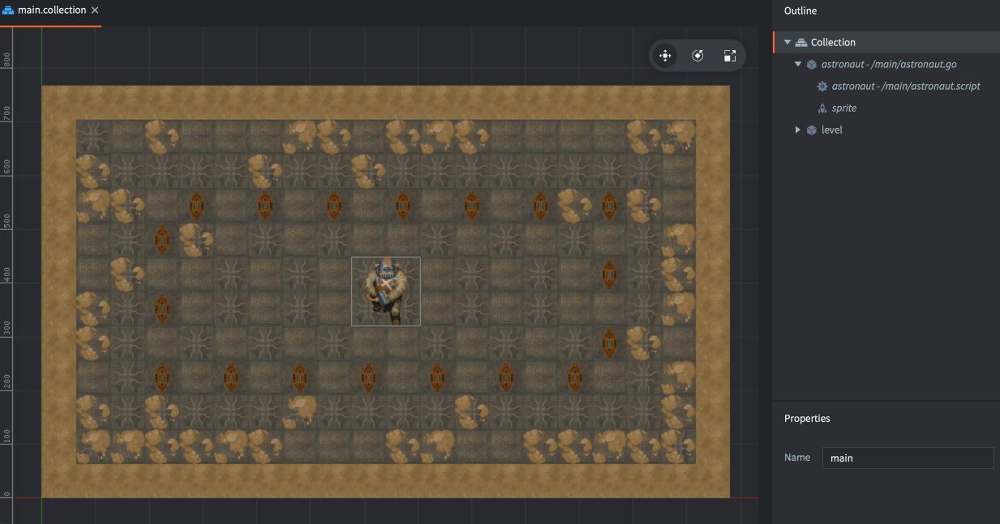
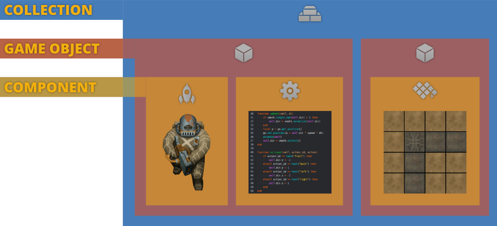
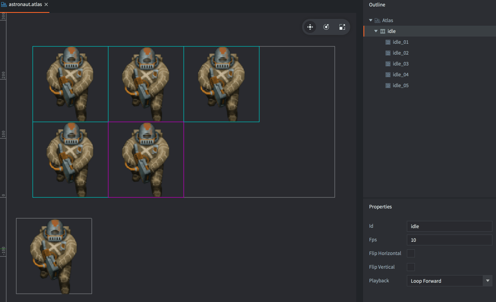

# Walking astronaut tutorial

In this beginner's tutorial you will learn how to capture player input and make a character move and animate. You will also learn about the core building blocks in Defold: game objects, components and collections.

This project is already set up containing all assets needed. Start by [running the game](defold://build) (<kbd>Project ▸ Build</kbd>) to get a feel for what's in here.

## The building blocks of a Defold game

Open ["main.collection"](defold://open?path=/main/main.collection) (locate the file in the *Assets* pane to the left and double click it.)

What you see in the editor is a *Collection* file. The collection contains two *Game Objects*. And the game objects contains one or two *Components* each. These are the building blocks that are available to build Defold games.

Collection
: Collection files contain game objects and other collections (sub-collections). You are able to organize game objects in a collection file by childing one or more game objects to a parent game object. You can use collections to build small things like a player character or a boss, and you can use them to build big things like whole levels.

  When the Defold engine starts, it loads a *bootstrap collection* as specified in the "game.project" settings file. This project's bootstrap collection is called "main.collection" and it is stored in the "main" folder.

Game Object
: Game objects are things that hold sprites, sounds, 3D models, tiles or scripts (programmed behavior). A game object has a position, rotation and scale and those properties can be manipulated while the game is running. A typical game object is a bullet or a level loader.

Component
: Components are the things that are drawn on screen, make sounds or that make things move.

The editor shows the visual content of the collection in the center editor view. The structure of the collection is shown in the *Outline* pane to the right. This collection contains two game objects: the astronaut game object and the background game object:

- The astronaut game object has *Id* "astronaut". It has been added to the main collection from a blueprint game object file named "/main/astronaut.go".
- The background game object has *Id* "level" and contains a tilemap component. The tilemap blueprint is stored in a tilemap file.

You can see the name of each blueprint file in the *Outline* pane to the right in the editor: Next to the game object name "astronaut", the filename "/main/astronaut.go" is written in italics. Similarly, "astronaut" contains a *Script Component*, also with *Id* "astronaut" that is based on the file "/main/astronaut.script".

## The astronaut game object

Open ["/main/astronaut.go"](defold://open?path=/main/astronaut.go) to view the blueprint file that is used to create the astronaut instance you see when you run the game.

The editor now shows the game object's content. The *Outline* view to the right lists all the components that are part of the game object. In this case that is a *Script* component and a *Sprite* component. The script is based on a file named "/main/astronaut.script" and the sprite is created embedded in place in the game object file.

Select the sprite component and take a look at the *Properties* that are associated with the component, in particular the *Image* and *Default Animation* properties.

Image
: The *Image* property points to an image resource that is used to source the sprite's visual representation from. In most cases the image resource is an *Atlas*, a collection of separate images that have been baked into a larger image for efficiency. The property is set to the file "/main/astronaut.atlas".

Default Animation
: This property sets the particular image or animation from the atlas that is used on the sprite. It is currently set to "idle".

When you [run the game](defold://build) you can see that the astronaut sprite is looping through an idle animation. Let's have a look at what the animation looks like.

## Adding more animations

Open the file ["/main/astronaut.atlas"](defold://open?path=/main/astronaut.atlas)

If you run into trouble, help is available in [our forum](https://forum.defold.com).

Happy Defolding!

---