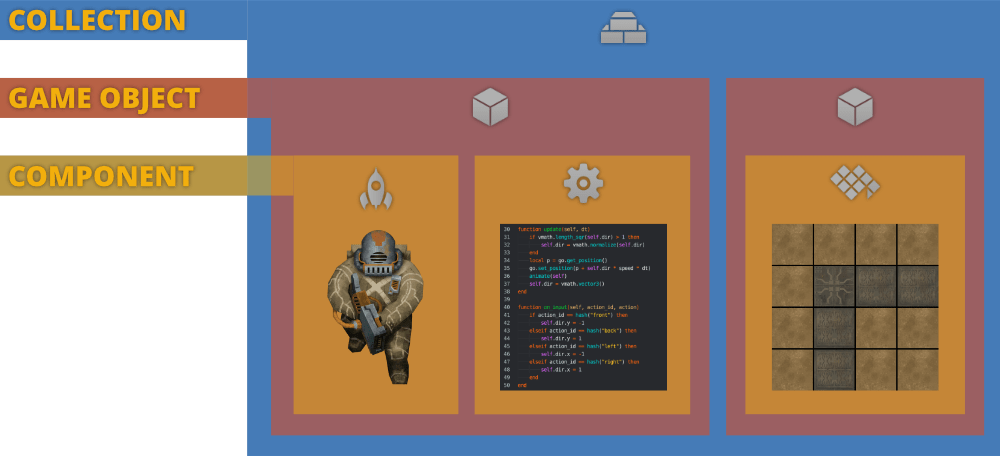

# Walking astronaut tutorial

In this beginner's tutorial you will learn how to capture player input and make a character move and animate. You will also learn about the core building blocks in Defold: game objects, components and collections.

This project is already set up containing all assets needed. Start by [running the game](defold://build) (<kbd>Project ▸ Build</kbd>) to get a feel for what's in here.

## The building blocks of a Defold game

Open ["main.collection"](defold://open?path=/main/main.collection) (locate the file in the *Assets* pane to the left and double click it.)


What you see in the editor is a *Collection* file. The collection contains two *Game Objects*. And the game objects contains one or two *Components* each. These are the building blocks that are available to build Defold games.



*COLLECTION*
: Collection files contain game objects and other collections (sub-collections). You are able to organize game objects in a collection file by childing one or more game objects to a parent game object. You can use collections to build small things like a player character or a boss, and you can use them to build big things like whole levels.

  When the Defold engine starts, it loads a *bootstrap collection* as specified in the "game.project" settings file. This project's bootstrap collection is called "main.collection" and it is stored in the "main" folder.

*GAME OBJECT*
: Game objects are things things that hold sprites, sounds, 3D models, tiles or scripts (programmed behavior). A game object has a position, rotation and scale. You can write script code that manipulate these properties while the game is running. A typical game object is a bullet, a pickup object or a level loader.

*COMPONENT*
: Components are the things that are drawn on screen, make sounds or that make things move. Components cannot exist on their own but must be put in a game object. Some components have properties that can be manipulated in runtime and most components can be turned on and off (enabled and disabled).

## What's in the main.collection file?

With the collection file open, the editor shows the visual content of the collection in the center editor view. You can also see the content as a tree structure in the *Outline* pane to the right. The file "main.collection" contains two game objects:

1. The astronaut game object which has *Id* "astronaut". It has been added to the main collection from a blueprint game object file named "/main/astronaut.go".

2. The background level game object which has *Id* "level" and contains a tilemap component. This game object has been added directly in the collection file. The tilemap component, however, is added from a blueprint file that contains the tilemap data.

There is no difference between game objects that has been embedded directly in a collection or ones that are based on blueprint files. If a game object exists in only one instance, there is no real advantage to using a blueprint file, but if you want to create many copies of the same object, blueprint files are extremely convenient.

You can see the name of each blueprint file in the *Outline* pane to the right in the editor: Next to the game object name "astronaut", the filename "/main/astronaut.go" is written in italics. Similarly, "astronaut" contains a *Script Component*, also with *Id* "astronaut" that is based on the file "/main/astronaut.script".

## The astronaut game object

Open ["/main/astronaut.go"](defold://open?path=/main/astronaut.go) to view the blueprint file that is used to create the astronaut instance in "main.collection". The editor now shows the game object's content visually in the center editor view. The *Outline* view to the right lists the structure which is all the components that are part of the game object:

1. A *Script* component that is is based on a file named "/main/astronaut.script".
2. A *Sprite* component that is created embedded in place in the game object file.


Click the sprite component to select it. The *Properties* view in the lower right corner now lists any properties that are associated with the component. You see that the sprite has its own *Id*, *Position* and *Rotation* properties. These are all relative to the game object that harbours the component. There are also properties that dictate what image or animation the sprite should display:

*Image*
: This property points to an image resource that is used to source the sprite's visual representation from. In most cases the image resource is an *Atlas*, a collection of separate images that have been baked into a larger image for efficiency. The property is set to the file "/main/astronaut.atlas".

*Default Animation*
: This property sets the particular image or animation from the atlas that is used on the sprite. It is currently set to the "idle" animation.

[Run the game again](defold://build). You can see that the astronaut sprite is looping through an idle animation. Let's now have a look at the animation setup.

## Adding animations to the astronaut

Open the file ["/main/astronaut.atlas"](defold://open?path=/main/astronaut.atlas). The editor now shows the content of the *Atlas* file that the astronaut sprite pulls its visuals from. The center editor view shows each image that has been added to the atlas. The *Outline* shows all the images and animations available in the atlas.


An animation group is a list of images that are played in a specified order at a specified playback speed. In this file there is one animation group, called "idle" that consists of 5 images. You can select the animation in the outline and select <kbd>View ▸ Play</kbd> from the menu to preview an animation. You may have to select <kbd>View ▸ Frame Selection</kbd> to zoom the editor camera to cover the whole atlas.

Now <kbd>right click</kbd> the root of the atlas outline and select <kbd>Add Animation Group</kbd>.


Click the new animation group (named "New Animation") and give it the *Id* "left". Then <kbd>right click</kbd> the animation group and select <kbd>Add Images...</kbd>


Type "left" in the top filter text field to see only images with the name "left" in them. Select all the images that appear (hold <kbd>Shift</kbd> and click), then click <kbd>OK</kbd>.


The new animation has 6 images in it. Select <kbd>View ▸ Play</kbd> from the menu to preview the animation. Notice that the speed of the animation is too high so set the *Fps* (frames per second) property of the "left" animation to 15.

Now, add animations for walking "right", "front" and "back" in the same way as you added the "left" animation.

## Programmming the astronaut movement

With all animation assets added to the astronaut atlas, the only thing you need to do is to write a bit of code to make the astronaut move.

Remember that the astronaut game object has a *Script* component based on the file "/main/astronaut.script"? Open ["/main/astronaut.script"](defold://open?path=/main/astronaut.script) to view the script file. As you can see, the script file contains a set of empty functions. These functions are the *lifetime functions* of the component:

`init(self)`
: This function is called when the component is initialized, before anything appears on the screen. We can use this function to set things up.

`final(self)`
: This function is called when the component is being removed. For instance when the game object is deleted or right before the engine shuts down your game.

`update(self, dt)`
: This function is called once each frame. This function is useful for doing manipulations and calculations that need to happen at real-time.

`on_message(self, message_id, message, sender)`
: This function is called each time a message is sent to the script component. We are not doing any message passing in this tutorial, but it is a central feature of Defold that you should learn about.

`on_input(self, action_id, action)`
: This function is called each time an input action is sent to the script. Input actions are defined in the file ["/input/game.input_binding"](defold://open?path=/input/game.input_binding). This project has bindings already set up for the arrow buttons: "left", "right", "front" and "back".

`on_reload(self)`
: This function is called whenever the current script component is *hot-reloaded* into a running game. This is very useful to inspect or manipulate the state of a game object at reload to test things or do debugging.

First, change the content of the `init()` function to the following:

```lua
local speed = 150                                             -- [1]

function init(self)
    msg.post(".", "acquire_input_focus")                      -- [2]
    self.dir = vmath.vector3()                                -- [3]
end
```
1. Define a local variable (constant) that holds the movement speed (in pixels/s).
2. Send a built in engine message to the current game object (".") telling it to listen to input.
3. Define a variable that is part of the current script component instance (`self`). The variable will hold the movement direction, expressed as a vector. It is initially zero.

Second, change the content of the `on_input()` function:

```lua
function on_input(self, action_id, action)
    if action_id == hash("front") then                        -- [1]
        self.dir.y = -1
    elseif action_id == hash("back") then
        self.dir.y = 1
    elseif action_id == hash("left") then                     -- [2]
        self.dir.x = -1
    elseif action_id == hash("right") then
        self.dir.x = 1
    end
end
```
1. If the user presses the "front" or "back" button, set the Y component of the movement direction.
2. If the user presses the "left" or "right" button, set the X component of the movement direction.

Third, change the content of the `update()` function:

```lua
function update(self, dt)
    if vmath.length_sqr(self.dir) > 1 then                   -- [1]
        self.dir = vmath.normalize(self.dir)
    end
    local p = go.get_position()                              -- [2]
    go.set_position(p + self.dir * speed * dt)               -- [3]
    self.dir = vmath.vector3()                               -- [4]
end
```
1. When the `update()` function is called, the engine has already processed all input, meaning that the direction vector is set. In the case where the player has pressed two buttons, resulting in a diagonal movement, the length of the movement vector is greater than 1 (length 1 along X and length 1 along Y). Normalizing the direction vector makes it length 1 and diagonal movement won't be faster than horizontal and vertical movement.
2. Get the position of the current game object. Note that the name `go` *does not* refer to the current game object. It is the name of the "game object" Lua module that contains all game object functions. You get the position of the current game object since no argument is given to the function.
3. Set the position of the current game object to the old position plus the direction scaled with the speed constant and `dt`. Multiplying with `dt` makes the movement velocity independent of the update frequency.
4. Reset the direction vector. It will be set each frame in `on_input`.

[Run the game again](defold://build) and verify that movement works as expected. The astronaut should move in all 8 directions depending on your input.

## Adding animations to the movement

The final piece of the puzzle is to change the animation that is played depending on the movement direction. For that, you have to first add a variable that holds the current animation:

```lua
function init(self)
    msg.post(".", "acquire_input_focus")
    self.dir = vmath.vector3()
    self.current_anim = nil                                  -- [1]
end
```
1. Store the currently running animation.

Then you need to add code in `update()` that changes animation based on direction:

```lua
function update(self, dt)
    if vmath.length_sqr(self.dir) > 1 then
        self.dir = vmath.normalize(self.dir)
    end
    local p = go.get_position()
    go.set_position(p + self.dir * speed * dt)

    local anim = hash("idle")                                  -- [1]

    if self.dir.x > 0 then                                     -- [2]
        anim = hash("right")
    elseif self.dir.x < 0 then
        anim = hash("left")
    elseif self.dir.y > 0 then
        anim = hash("back")
    elseif self.dir.y < 0 then
        anim = hash("front")
    end

    if anim ~= self.current_anim then                          -- [3]
        msg.post("#sprite", "play_animation", { id = anim })   -- [4]
        self.current_anim = anim                               -- [5]
    end

    self.dir = vmath.vector3()
end
```
1. Local variable that starts with the default animation id.
2. Test against the movement direction and set the anim variable depending on the value of the X and Y component in the direction vector.
3. If the anim that the code wants to play is different than the currently playing animation:
4. then play the new animation,
5. then set the currently playing animation id to the new animation id.

The test against the current animation is required, otherwise would the code restart the same animation over and over again each frame.

[Run the game again](defold://build) and verify that the astronaut animates together with the movement. Note that the diagonal movements do not have their own animations but depending on the order of the tests agains `self.dir` X and Y components in `update()` animations for those cases are picked.

**Congratulations! You have now finished this tutorial. We hope that you found it instructive.**

Check out the [documentation pages](https://defold.com/learn) for more examples, tutorials, manuals and API docs.

If you run into trouble, help is available in [our forum](https://forum.defold.com).

Happy Defolding!


## The complete movement script

```lua
local speed = 150

function init(self)
    msg.post(".", "acquire_input_focus")
    self.dir = vmath.vector3()
    self.current_anim = nil
end

function update(self, dt)
    if vmath.length_sqr(self.dir) > 1 then
        self.dir = vmath.normalize(self.dir)
    end
    local p = go.get_position()
    go.set_position(p + self.dir * speed * dt)

    local anim = hash("idle")

    if self.dir.x > 0 then
        anim = hash("right")
    elseif self.dir.x < 0 then
        anim = hash("left")
    elseif self.dir.y > 0 then
        anim = hash("back")
    elseif self.dir.y < 0 then
        anim = hash("front")
    end

    if anim ~= self.current_anim then
        msg.post("#sprite", "play_animation", { id = anim })
        self.current_anim = anim
    end

    self.dir = vmath.vector3()
end

function on_input(self, action_id, action)
    if action_id == hash("front") then
        self.dir.y = -1
    elseif action_id == hash("back") then
        self.dir.y = 1
    elseif action_id == hash("left") then
        self.dir.x = -1
    elseif action_id == hash("right") then
        self.dir.x = 1
    end
end
```

---